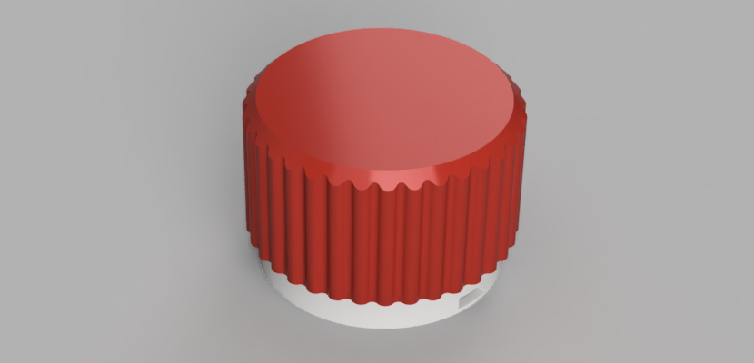

# 🕹️ media-knob

> Media knob with rotary encoder for controlling volume and mute state.

## Parts

+ device - TINY85 Digispark USB module to control rotary encoder
+ stl - 3d-models for printing
+ KY-40 rotary encoder

## Install

+ `TrinketHidCombo`

## Button control

`single click` - mice mute/un-mute

`rotate` - volume up/down

## Support

